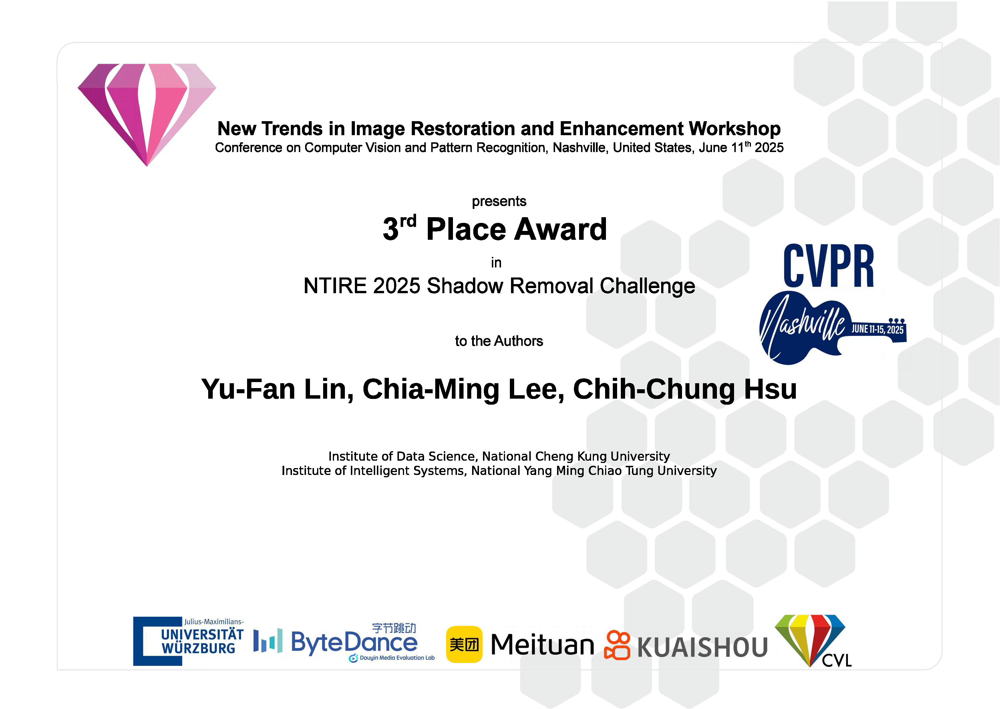
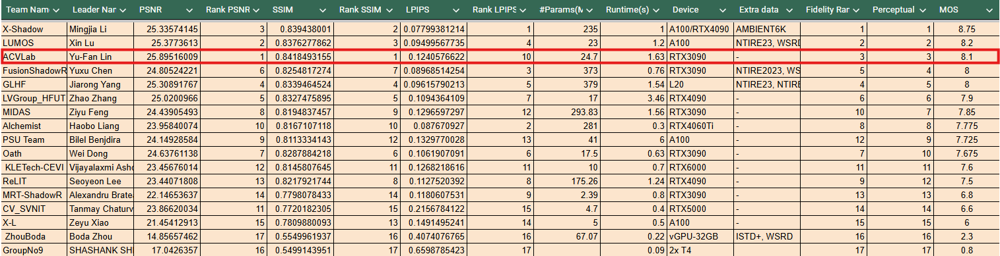
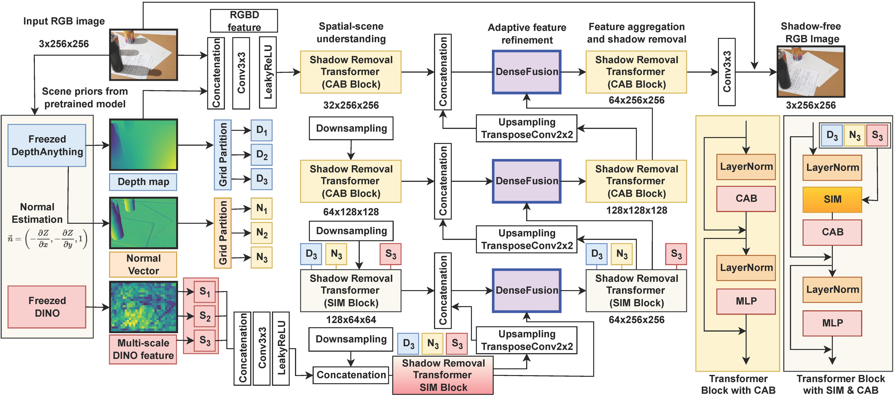

<h1 align="center">DenseSR: Image Shadow Removal as Dense Prediction (ACMMM 2025)</h1>
<div align="center">

[Yu-Fan Lin](https://vanlinlin.github.io/)<sup>1</sup>, 
[Chia-ming Lee](https://ming053l.github.io/)<sup>1</sup>, 
Chih-Chung Hsu<sup>2</sup>

</div>
<p align="center"><sup>1</sup>National Cheng Kung University&nbsp;&nbsp;<sup>2</sup>National Yang Ming Chiao Tung University</p>

<div align="center">

[](https://www.arxiv.org/abs/2507.16472)


</div>





<details>
<summary>Abstract</summary>
Shadows are a common factor degrading image quality. Single-image shadow removal (SR), particularly under challenging indirect illumination, is hampered by non-uniform content degradation and inherent ambiguity. Consequently, traditional methods often fail to simultaneously recover intra-shadow details and maintain sharp boundaries, resulting in inconsistent restoration and blurring that negatively affect both downstream applications and the overall viewing experience. To overcome these limitations, we propose the DenseSR, approaching the problem from a dense prediction perspective to emphasize restoration quality. This framework uniquely synergizes two key strategies: (1) deep scene understanding guided by geometric-semantic priors to resolve ambiguity and implicitly localize shadows, and (2) high-fidelity restoration via a novel Dense Fusion Block (DFB) in the decoder. The DFB employs adaptive component processing-using an Adaptive Content Smoothing Module (ACSM) for consistent appearance and a Texture-Boundary Recuperation Module (TBRM) for fine textures and sharp boundaries-thereby directly tackling the inconsistent restoration and blurring issues. These purposefully processed components are effectively fused, yielding an optimized feature representation preserving both consistency and fidelity. Extensive experimental results demonstrate the merits of our approach over existing methods.
</details>

## 👉 Overview


## 💫 Features
1. **Model Flexibility:** Choose between **DINOv3** (default) or **DINOv2** for feature extraction.
2. **Enhanced Depth Estimation:** Supports [DepthPro](https://arxiv.org/abs/2410.10815) (via `rgb2depth.ipynb`) for superior depth maps compared to Depth Anything v2.


## 🌱 Environments
```bash
conda create -n densesr python=3.10 -y

conda activate densesr

pip install torch==2.0.1 torchvision==0.15.2 torchaudio==2.0.2 --index-url https://download.pytorch.org/whl/cu118

pip install -r requirements.txt

```

## 📂 Folder Structure
You can download WSRD dataset from [here](https://github.com/fvasluianu97/WSRD-DNSR).
```bash
train_dir
├── origin          <- Put the shadow affected images in this folder
│   ├── 0000.png
│   ├── 0001.png
│   ├── ...
├── depth
├── normal
├── shadow_free
│   ├── 0000.png
│   ├── 0001.png
│   ├── ...


test_dir
├── origin          <- Put the shadow affected images in this folder
│   ├── 0000.png
│   ├── 0001.png
│   ├── ...
├── depth
├── normal


output_dir
├── 0000.png
├── 0001.png
├──...
```

1. Clone [Depth anything v2](https://github.com/DepthAnything/Depth-Anything-V2.git) or you can just use the rgb2depth.ipynb file with DepthPro model

```bash
git clone https://github.com/DepthAnything/Depth-Anything-V2.git
```
2. Download the [pretrain model of depth anything v2](https://huggingface.co/depth-anything/Depth-Anything-V2-Large/resolve/main/depth_anything_v2_vitl.pth?download=true)

3. Run ```get_depth_normap.py``` to create depth and normal map.
```python
python get_depth_normap.py
```

Now folder structure will be
```bash
train_dir
├── origin
│   ├── 0000.png
│   ├── 0001.png
│   ├── ...
├── depth
│   ├── 0000.npy
│   ├── 0001.npy
│   ├── ...
├── normal
│   ├── 0000.npy
│   ├── 0001.npy
│   ├── ...
├── shadow_free
│   ├── 0000.png
│   ├── 0001.png
│   ├── ...


test_dir
├── origin
│   ├── 0000.png
│   ├── 0001.png
│   ├── ...
├── depth
│   ├── 0000.npy
│   ├── 0001.npy
│   ├── ...
├── normal
│   ├── 0000.npy
│   ├── 0001.npy
│   ├── ...

output_dir
├── 0000.png
├── 0001.png
├──...
```

4. Clone [DINOv2](https://github.com/facebookresearch/dinov2.git) or [DINOv3](https://github.com/facebookresearch/dinov3)
```bash
git clone https://github.com/facebookresearch/dinov2.git
```

5. Download [Pretrained weight](https://huggingface.co/VanLinLin/DenseSR)

## 🔥 How to train?
1. Run `densesr_train.sh` to start training.

```bash
# Default training (uses DINOv3)
bash densesr_train.sh
```

To switch to **DINOv2**, you can modify `densesr_train.sh` or run the command manually:

```bash
CUDA_VISIBLE_DEVICES="0" torchrun --nproc_per_node 1 --master_port 29500 densesr_train_DDP.py \
    --win_size 8 \
    --train_ps 256 \
    --dino_version dinov2 \
    --dino_model vitl14
```

## ✨ How to test?
1. Run ```run_test.sh``` to get inference results.

```bash
bash run_test.sh
```

## 📰 News
&#10004; 2026/01/30 Release training code

&#10004; 2026/01/11 Release ISTD pretrained model

&#10004; 2025/08/11 Release WSRD pretrained model

&#10004; 2025/08/11 Release inference code

&#10004; 2025/07/05 Paper Accepted by ACMMM'25

## ⭐ Citation
If you find this project useful, please consider citing us and giving us a star.
```bibtex
@misc{lin2025densesrimageshadowremoval,
      title={DenseSR: Image Shadow Removal as Dense Prediction}, 
      author={Yu-Fan Lin and Chia-Ming Lee and Chih-Chung Hsu},
      year={2025},
      eprint={2507.16472},
      archivePrefix={arXiv},
      primaryClass={cs.CV},
      url={https://arxiv.org/abs/2507.16472}, 
}
```


## 📜 License
This code repository is release under [MIT License](https://github.com/VanLinLin/NTIRE25_Shadow_Removal?tab=MIT-1-ov-file#readme).
